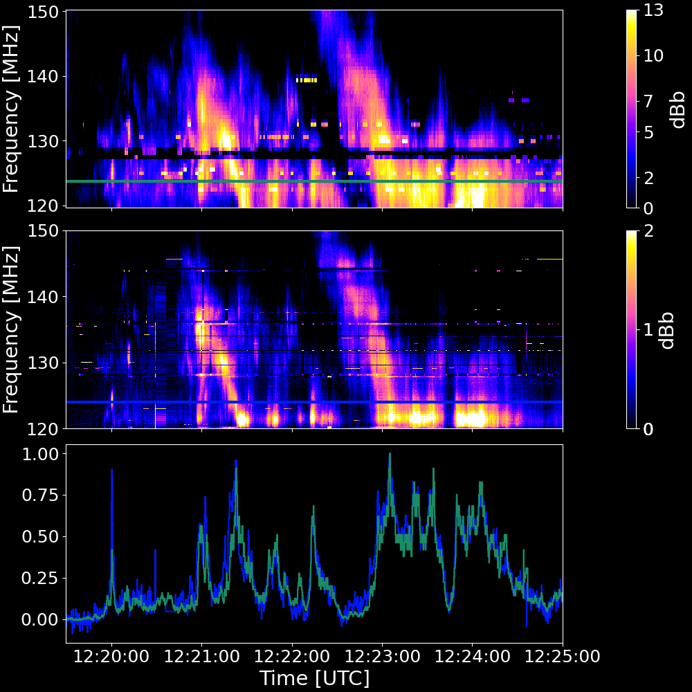

# __SPECTRE: Process, Explore and Capture Transient Radio Emissions__

## Overview

:loudspeaker: **This project is under active development. Contributors welcome.**  :loudspeaker:

`spectre` is a receiver-agnostic program for recording and visualising radio spectrograms. Powered by [GNU Radio](https://www.gnuradio.org/).

**Features**:  

- Intuitive CLI tool :computer:
- Wide receiver support :satellite:
- Live recording of radio spectrograms and I/Q data :floppy_disk:
- Flexible, configurable data capture :gear:
- Containerised backend :whale:
- Developer-friendly, extensible digital signal processing framework :hammer_and_wrench:

## Solar Radio Observations :sunny:
Observations of the huge X9.0 solar flare on October 3rd 2024. A comparison of a ```spectre``` spectrogram (second panel) captured in the West End of Glasgow, to that observed by the [CALLISTO](https://e-callisto.org/) spectrometer stationed in Egypt, Alexandria (top panel)



## Supported Receivers

Initial support is focused on the SDRplay RSP* series via [`gr-sdrplay3`](https://github.com/fventuri/gr-sdrplay3). A wide range of receiver support is planned.

Current supported receivers include:  

- [RSP1A (from SDRPlay)](https://www.sdrplay.com/rsp1a/)
- [RSPduo (from SDRPlay)](https://www.sdrplay.com/rspduo/)

The framework is in place to integrate the following receivers, this is planned for the near future:  

- RSP1, RSP1B, RSP2, RSPdx (via [`gr-sdrplay3`](https://github.com/fventuri/gr-sdrplay3))
- USRP SDRs (e.g., the [b200-mini](https://www.ettus.com/all-products/usrp-b200mini/))
- RTLSDR, AirspyHF, BladeRF, HackRF, LimeSDR, PLUTO (via [`Soapy`](https://wiki.gnuradio.org/index.php/Soapy))

**Please note! SDRPlay clones (i.e. unofficially produced copies of SDRPlay receivers) will likely not work with spectre as they are not compatible with the official SDRPlay API**. 

## Supported Operating Systems and Platforms
This project is tested to be compatible with the following operating systems and architectures:

- Ubuntu 22.04.3 on (x86-64, arm64) architectures
- Debian GNU/Linux 12 (bookworm) on arm64 architecture

It may also work on other Linux distributions. Specifically, I have personally tested it on a Thinkpad P1G5 running Ubuntu 22.04.3 and a Raspberry Pi 4 Model B running Ubuntu Desktop, Raspberry Pi OS and Raspberry Pi OS Lite.

Support for Windows will be explored in the future.


## Installation

### **Prerequisites**
- Ensure the [Docker Engine](https://docs.docker.com/engine/install/ubuntu/) is installed on your machine.
- Although the back-end is fully containerised, you must install any relevant third-party drivers on your host system. You can do so from the following external links.

| Company | Link                          | Required version |
| ------- | ----------------------------- | ---------------- |
| SDRPlay | https://www.sdrplay.com/api/  | 3.15.2           |


### **Initial setup**
1. Clone the ```spectre``` GitHub repository:  
   ```bash
   git clone https://github.com/jcfitzpatrick12/spectre.git
   ```
2. Change directory into the newly cloned ```spectre``` repository:  
   ```bash
   cd spectre
   ```
3. Set the only required environment variable for the ```spectre``` program in the current terminal:  
   ```bash
   export SPECTRE_DATA_DIR_PATH=$(pwd)/.spectre-data
   ```

4. And ensure that environment variable is set as a perminent shell configuration:  
   ```bash
   echo "export SPECTRE_DATA_DIR_PATH=$(pwd)/.spectre-data" >> ~/.bashrc
   ```


### **Starting the `spectre-server`**
The `spectre-server` container must be running to respond to `spectre-cli` requests. The following commands assume your working directory corresponds to the cloned ```spectre``` repository.

1. Build the image (this can take a bit of time):    
   ```bash
   docker build --tag spectre-server backend
   ```

2. Run the `spectre-server` container:  
   ```bash
   docker run --detach \
              --rm \
              --publish 127.0.0.1:5000:5000 \
              --name spectre-server \
              --volume /dev/shm:/dev/shm \
              --volume $SPECTRE_DATA_DIR_PATH:/home/spectre/.spectre-data \
              spectre-server 
   ```
 
3. At any time, you can stop the ```spectre-server``` using:    
   ```bash
   docker container stop spectre-server --signal kill
   ```


### **Running the `spectre-cli`**
The following commands assume your working directory corresponds to the cloned ```spectre``` repository.

1. Create a Python virtual environment:  
   ```bash
   python3 -m venv ./venv
   ```

2. Activate the virtual environment:  
   ```bash
   source ./venv/bin/activate
   ```

3. Install the required dependencies:  
   ```bash
   pip install -e .
   ```

4. Verify the CLI is operational:  
   ```bash
   spectre --version
   ```
Notably, the CLI commands will only work with the virtual environment activated.


## Installation for developers

We provide the lightly modified ```Dockerfile.dev``` for easier development. This image includes:  

- GUI capablities (so permitting GNURadio companion)
- Installs ```spectre``` and ```spectre-core``` in editable mode.
- Does not impose fixed versioning on ```spectre``` and ```spectre-core```
- Does not delete any OOT modules once they have been installed (allowing rebuilds)

The following commands assume your working directory corresponds to the cloned ```spectre``` repository.

1. Build the image, but point to our development Dockerfile:  
   ```bash
   docker build -t spectre-dev-server -f backend/Dockerfile.dev backend
   ```

2. Run the `spectre-server` container:  
   ```bash
   # Enable xhost for the local machine only
   xhost local:

   docker run --rm \
            --publish 127.0.0.1:5000:5000 \
            --name spectre-dev-server \
            --volume /dev/shm:/dev/shm \
            --volume $SPECTRE_DATA_DIR_PATH:/home/spectre/.spectre-data \
               -e DISPLAY=$DISPLAY \
               -v /tmp/.X11-unix:/tmp/.X11-unix \
               --interactive \
               --tty \
               spectre-dev-server \
               /bin/bash

   # Reset xhost
   xhost -
   ```


## Contributing
This repository is in active development. If you are interested, feel free to contact  jcfitzpatrick12@gmail.com :)
